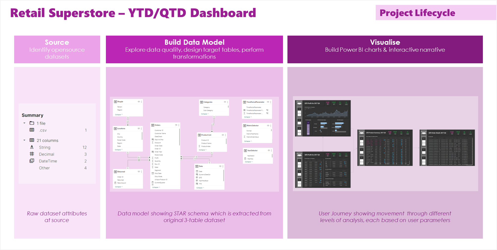

# SuperStore-PowerBI
Welcome to this repository for the build of a financial analysis dashboard relating to the well-known Sample SuperStore dataset!

The full project lifecycle and outcome insights are detailed further in the [project overview document](./docs/ProjectSummary.pdf)

The Power BI dashboard demonstrates how multiple end-users can be catered for in one place. The majority of the dashboard focuses on the Financial lense - there is a lot of other tangential analysis that could be done! (Some exampled being detail on customer segmentation, repeat customers, customer lifetime value, related products which could drive offers, etc...)

The user journey therefore focusses on moving through from high- to low- level detail, with the ability to see individual orders. In a realistic scenario, app-level and row-level security would be important tools in ensuring that data is available on a need-to-know basis.

We also focus on flexibility, enabling the user to choose a metric of focus. This means that they can see a simplified view of the data they are interested in, rather than being faced with a high number of data points at one time.

All data preparation is performed using Power Query, and all visualisations used in this dashboard are Power BI native.

Data is downloaded from [Tableau here](https://www.tableau.com/sites/default/files/2021-05/Sample%20-%20Superstore.xls) - as a popular dataset, the longer term aim is to have example dashboards from both Tableau and Power BI within this repo. Further information on this dataset is available on [Kaggle](https://www.kaggle.com/datasets/vivek468/superstore-dataset-final) - note that whilst this references an older version of this data, the only difference to the Tableau-hosted data is the simulated year values to keep it current.